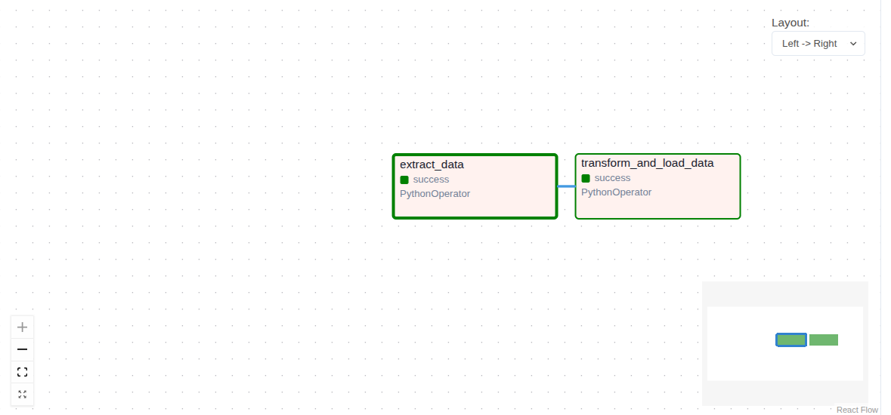

# 🚀 Crypto Data Pipeline (ETL with Docker, Airflow & PostgreSQL)


---

## 📌 Overview

This project implements a modular ETL (Extract, Transform, Load) pipeline for collecting cryptocurrency market data from the CoinGecko API and storing it in a PostgreSQL database.

The pipeline is designed with a data engineering mindset, focusing on:

- clean architecture
- reproducibility
- containerized execution using Docker
- workflow orchestration using Apache Airflow

---

## 🧠 Key Features

- Modular ETL pipeline (Extract / Transform / Load separation)
- API data ingestion using Python (Requests)
- Data cleaning and transformation with Pandas
- Relational storage in PostgreSQL
- Workflow orchestration using Apache Airflow
- Fully containerized environment using Docker Compose
- Configurable environment using `.env`

---

## 🏗️ Architecture

### Pipeline Flow

CoinGecko API  
↓  
extract_crypto.py  
↓  
transform_crypto.py  
↓  
load_crypto.py  
↓  
PostgreSQL (`crypto_prices` table)

---

## 📊 Apache Airflow Orchestration

This ETL workflow is automated using Apache Airflow.

### DAG Workflow

Extract → Transform → Load

Tasks:

- extract_data
- transform_and_load_data

This ensures:

- task dependency management
- scheduled execution
- monitoring and retry capability



---

## 🗄 PostgreSQL Output Verification

Data successfully loaded into PostgreSQL.

Query used:

```sql
SELECT * FROM crypto_prices;


---

🐳 Docker Running Services
The project runs in multiple Docker containers using Docker Compose.

Running services:

PostgreSQL
Apache Airflow Webserver
Apache Airflow Scheduler
ETL Application Container

---

📂 Project Structure
crypto-data-pipeline/
│
├── dags/
│   └── crypto_pipeline_dag.py
│
├── scripts/
│   ├── extract_crypto.py
│   ├── transform_crypto.py
│   ├── load_crypto.py
│   └── config.py
│
├── data/
│   ├── raw/
│   └── processed/
│
├── docs/
│   ├── airflow-dag.png
│   ├── postgres-result.png
│   └── docker-containers.png
│
├── logs/
├── airflow/
├── .env.example
├── docker-compose.yml
├── Dockerfile
├── requirements.txt
└── README.md

---

⚙️ Setup & Execution

1. Clone Repository
git clone https://github.com/atefehfahimirad28-droid/crypto-data-pipeline.git
cd crypto-data-pipeline

2. Configure Environment
cp .env.example .env
Update database credentials if needed.

3. Start Docker Services
docker compose up -d --build


4. Run ETL Pipeline
python3 -m scripts.load_crypto
or through Airflow DAG execution.
---


🗄 Database Schema
Table: crypto_prices
Column	Type	Description
coin	TEXT	Cryptocurrency name
price_usd	FLOAT	Price in USD
extracted_at	TIMESTAMP	Extraction timestamp

---

🔍 Data Verification
Access PostgreSQL:

docker exec -it crypto_postgres psql -U postgres -d crypto_db

Run query:

SELECT * FROM crypto_prices;

---

📜 Logging & Debugging
The pipeline provides logging for each stage:

[INFO] Extracted data from API
[INFO] Transformed data successfully
[INFO] Loaded data into PostgreSQL

Check logs:

docker compose logs -f

---

🧰 Common Operations
Stop containers
docker compose down

Remove volumes
docker compose down -v

Rebuild containers
docker compose up -d --build

---

🚀 Future Improvements
Add AWS S3 for raw data storage
Implement Kafka for streaming ingestion
Add CI/CD with GitHub Actions
Build monitoring dashboards
Add automated testing with pytest

---

💡 Key Learnings
Designing modular ETL pipelines
Working with REST APIs and JSON data
Data transformation using Pandas
PostgreSQL database integration
Docker-based development environments
Apache Airflow orchestration

---

👤 Author
Atefeh Fahimirad
Junior Data Engineer

GitHub:
https://github.com/atefehfahimirad28-droid
